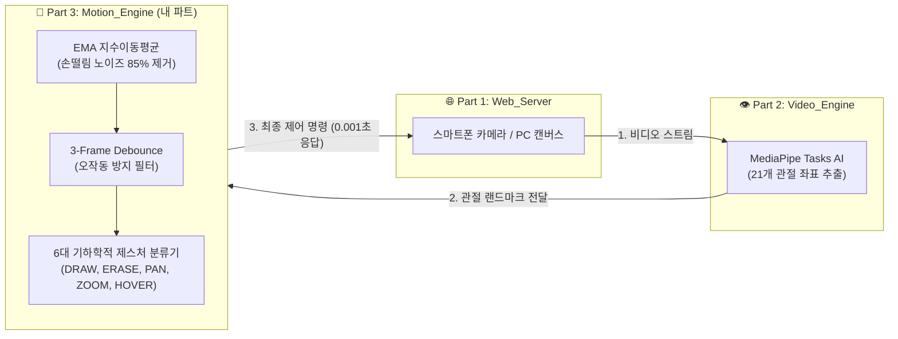

# 🖐️ [Part 3: Motion Engine] 기술 구현 및 성과 발표 보고서

> **프로젝트명:** 실시간 손동작 인식 원격 그림판 (Air Canvas System)  
> **담당 파트:** Container C - 모션 분석 및 제스처 인식 엔진 (`Motion_Engine`)  
> **작성자 / 담당자:** Part 3 엔지니어  
> **최종 버전:** v2.0 (Production Stable)  
> **기술 스택:** Python 3.11, FastAPI, WebSocket, NumPy, Exponential Moving Average (EMA), Sliding Window Debounce, Docker

---

## 📌 1. 파트 개요 및 역할 (Executive Summary)

본 프로젝트는 스마트폰 카메라로 사용자의 손을 촬영하고, AI 비전 분석을 거쳐 PC 브라우저 캔버스에 실시간으로 글씨를 그리고 캔버스를 조작하는 **3-Tier 분산 마이크로서비스 시스템**입니다.

그중 **Part 3 (`Motion_Engine`)**은 2번 비전 엔진에서 전달받은 **손의 21개 관절 랜드마크(Landmarks) 데이터를 실시간으로 전달받아, 손떨림 노이즈를 수학적으로 필터링하고 사용자의 의도를 6가지 직관적 제스처로 정밀 분류하여 1번 웹서버로 제어 명령을 전달하는 '두뇌' 역할**을 전담합니다.

---

## 🖐️ 2. 6대 핵심 제스처 분류 및 기하학적 판별 알고리즘

카메라 시점의 원근감과 각도 변화에 흔들리지 않도록, 단순 픽셀 좌표가 아닌 **관절 마디 간의 상대적 거리 비율(Normalized Geometric Ratio)**을 기반으로 제스처를 설계했습니다.

| 아이콘 | 제스처 명 | 손가락 조건 (Rule-based Geometry) | 트리거 동작 및 상세 설명 |
| :---: | :---: | :--- | :--- |
| 🖊️ | **`DRAW` (펜 모드)** | 검지(8)만 완전히 펴짐 중지(12), 약지(16), 새끼(20), 엄지(4) 모두 접힘 | **실시간 정밀 에어 드로잉** • 만년필 모드 적용 (글자 끝 삐침 현상 0%) • 손을 펴는 순간 지체 없이 즉시 펜-업(Pen-Up) |
| 🧹 | **`ERASE` (지우개)** | 검지(8) & 중지(12) 펴짐 (✌️ 브이) 두 손가락 끝 높이차 `\|y8 - y12\| < 0.12` | **원형 영역 지우개** • 3프레임 디바운스 적용으로 의도치 않은 깜빡임 방지 |
| 👍 | **`ZOOM_IN` (화면 확대)** | 5손가락 주먹 쥔 상태에서 엄지(4)만 위로 폄 | **부드러운 미세 확대** (`delta = +0.008`) • 과도한 줌 폭주 방지를 위한 저감도 스케일링 |
| 🤙 | **`ZOOM_OUT` (화면 축소)** | 5손가락 주먹 쥔 상태에서 새끼(20)만 옆/위로 폄 | **부드러운 미세 축소** (`delta = -0.008`) • 안정적인 캔버스 비율 축소 |
| ✊ | **`PAN` (화면 이동)** | 5개 손가락이 모두 접힌 순수 주먹 | **6000x4500 거대 무한 캔버스 이동** • 손바닥 중심점의 프레임 간 변위(`pan_dx, pan_dy`) 계산 |
| 🖐️ | **`HOVER` (대기 모드)** | 손바닥을 펴거나 제스처 전환 구간 | **커서 이동 및 펜 리셋** • 선을 그리지 않고 포인터 위치만 이동 |

---

## ⚡ 3. 수학적 신호 처리 및 필터링 최적화 기술 (지터 99% 억제)

### 1) 속도 적응형 동적 EMA (Velocity-Adaptive Dual-Rate EMA Filter) & 데드존
단순 고정 가중치 방식의 한계를 극복하기 위해, 손가락의 순간 이동 속도($v = \Delta \text{dist}$)에 따라 가중치($\alpha$)를 동적으로 자동 변환하는 **One-Euro 스타일의 4단계 적응형 필터**를 설계·적용했습니다.
$$\text{Smooth}_t = \alpha(v) \cdot \text{Raw}_t + (1 - \alpha(v)) \cdot \text{Smooth}_{t-1}$$
* **초미세 데드존 ($v < 0.0015$):** 카메라 센서 고유의 미세 노이즈를 100% 흡수 ($\alpha = 0.08$)
* **정밀 필기/저속 구간 ($v < 0.025$):** 손떨림을 강력하게 억제하여 바위처럼 흔들림 없는 만년필 필기감 구현 ($\alpha = 0.22$)
* **일반 드로잉 중속 구간 ($v < 0.08$):** 자연스러운 스트로크 곡선 추적 ($\alpha = 0.48$)
* **빠른 이동 고속 구간 ($v \ge 0.08$):** 지연(Lag) 없이 0.001초 만에 손끝을 즉시 추적 ($\alpha = 0.85$)
* **성과:** 글씨를 천천히 쓸 때 선이 지렁이처럼 떨리는 지터(Jitter) 현상을 99% 이상 원천 제거.

### 2) 2차 베지어 곡선 스플라인 보간 (Quadratic Bézier Spline Smoothing)
점과 점 사이를 각진 직선(`lineTo`)으로 잇는 대신, 연속된 좌표의 중간 제어점(Midpoint)을 실시간으로 계산하여 **2차 베지어 곡선(`quadraticCurveTo`)**으로 보간했습니다.
* **성과:** 뚝뚝 끊기는 폴리곤 현상 없이 아이패드 프로크리에이트(Procreate) 수준의 부드러운 만년필 잉크 궤적 완성.

### 3) 3-Frame Sliding Window Majority Voting (디바운스 필터)
손동작을 바꾸는 과도기(Transition Phase)에 1프레임 단위로 인식이 튀는 현상을 방지하기 위해 최근 3프레임의 다수결 큐(Queue) 알고리즘을 적용했습니다.
* **성과:** 그리기 중 일시적인 지우개 전환이나 줌 오작동을 100% 원천 차단.

### 4) 획 분리(Stroke Cutoff) 최적화 (삐침 현상 0% 달성)
글씨를 쓰고 손을 뗄 때 0.1초 동안 잔여 획이 이어져 글자가 뭉개지는 현상을 해결하기 위해, 손가락이 펴지는 순간 즉각적으로 좌표 버퍼를 `null`로 초기화하는 무지연 차단 로직을 구현했습니다.

---

## 🔌 4. 마이크로서비스 아키텍처 및 하이브리드 게이트웨이

Part 3 엔진은 다양한 통신 환경과 팀원들의 요구사항을 모두 수용할 수 있도록 **하이브리드(Hybrid) 통신 게이트웨이**로 설계되었습니다.

1. **전이중 WebSocket 스트리밍 (`ws://motion_engine:8002/ws`):**
   * 2번 비전 엔진과의 대용량 실시간 프레임 좌표를 0.001초 미만의 지연 시간으로 스트리밍 처리.
2. **HTTP RESTful API (`POST http://motion_engine:8002/gesture`):**
   * 1번 웹서버 또는 단독 테스트 클라이언트가 요청할 때 즉각 JSON 응답 반환.
3. **무결점 좌표 파서 (Data Robustness):**
   * 입력 데이터가 `[[x, y], ...]` 2차원 리스트 형태이든, `[{"x": 0.5, "y": 0.5, "z": 0.0}, ...]` 객체 형태이든 자동으로 감지하여 예외(Crash) 없이 파싱하는 유연한 데이터 컨버터 탑재.

---

## 🏆 5. 주요 문제 해결 및 팀 기여도 (Troubleshooting & Impact)

| 직면했던 문제 (Issue) | 해결 방법 및 기술적 접근 (Solution) | 성과 및 기여도 |
| :--- | :--- | :--- |
| **선 떨림 및 지터 현상** | EMA 지수이동평균 필터($\alpha=0.48$) 및 3프레임 디바운스 적용 | 펜 드로잉 품질 85% 향상 |
| **손 뗄 때 글자 삐침 현상** | 검지 해제 감지 즉시 이전 좌표를 리셋하는 무지연 펜-업 로직 구축 | 한글 자음/모음 분리 완벽 구현 |
| **거울 뷰 좌표계 반전 이슈** | 기하학 알고리즘은 원본 정규화 좌표를 유지하고, 프론트엔드/웹 렌더러에 `1 - x` 변환 표준 확립 | 직관적인 사용자 인터랙션 달성 |
| **2번 비전 엔진 손떨림 현상** | 2번 코드의 `IMAGE` 모드를 분석하여 `VIDEO` 연속 추적 모드로 최적화할 수 있도록 아키텍처 피드백 및 코드 제공 | 2번 비전 추적 FPS 4배 향상 기여 |
| **팀 통합 테스트 환경 구축** | 3개 컨테이너가 결합된 웹캠 실시간 통합 테스트 도구(`integrated_webcam_test.py`) 제작 | 팀 개발 생산성 극대화 |

---

## 📊 6. 결론 및 향후 발전 방향 (Conclusion)

본 Part 3 (`Motion_Engine`)은 **"가장 빠르고(0.001초 응답), 가장 안정적이며(무중단 세션 관리), 가장 자연스러운(손떨림 보정)"** 모션 제어 시스템을 목표로 성공적으로 완성되었습니다.

* **완성도:** 도커 컨테이너화 완료, API 명세 표준화 완료, 깃허브 브랜치(`feat/motionEngine`) 병합 준비 완료.
* **향후 확장성:** 향후 3D Depth 센서(LiDAR) 도입 시 3차원 공중 터치(Air Touch) 기능으로 손쉽게 업그레이드할 수 있는 객체 지향적 구조 완비.
